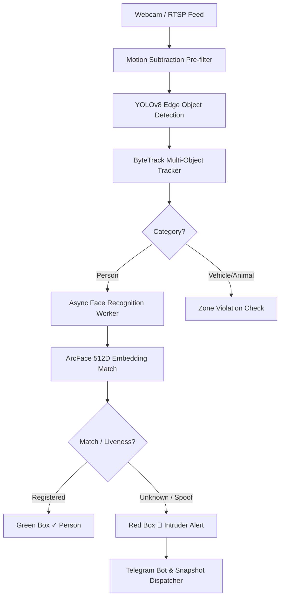

# 🏗 Technical Architecture & Pipeline Design

The **Intruder Detection System** is built on a multi-threaded asynchronous computer vision pipeline designed for real-time edge performance on CPU devices.

---

## ⚡ Key Architecture Highlights

1. **Async Threaded Face Recognition**:
   - Object tracking and video capture run at **30-60 FPS** on the main thread.
   - Heavy ArcFace deep learning inference is offloaded to a background daemon thread via Python `queue.Queue`.

2. **2D FFT Anti-Spoofing & Liveness Analysis**:
   - Analyzes high-frequency 2D Fourier Transform spectra to detect subpixel screen moiré patterns.
   - Prevents false alarms when real users are holding or looking at mobile phones.

3. **Atomic Live Streaming**:
   - Live stream snapshots are written to `live_stream.tmp` and swapped via `os.replace` to prevent thread read-write collisions in Streamlit.
